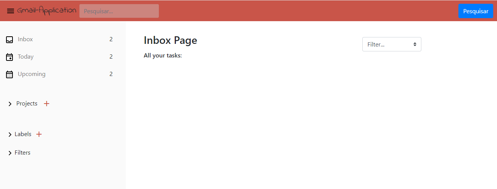
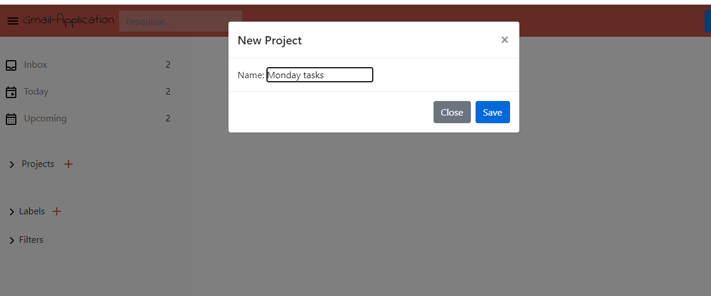
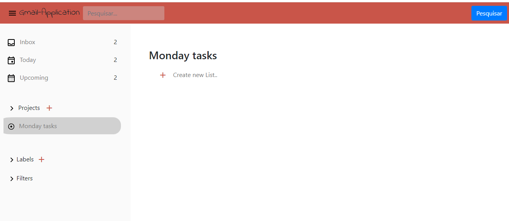
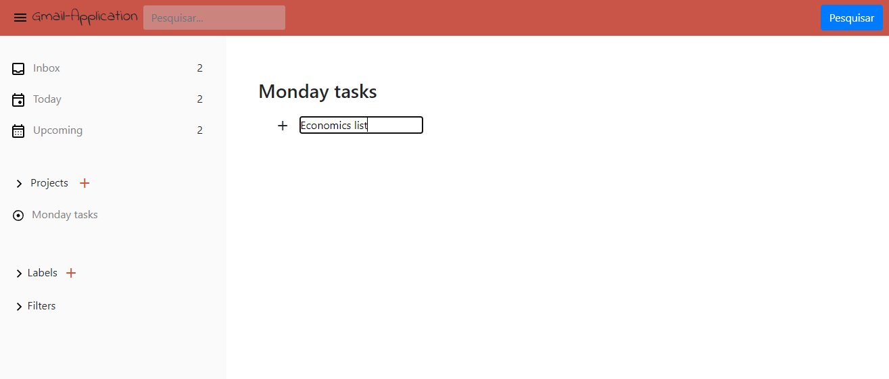
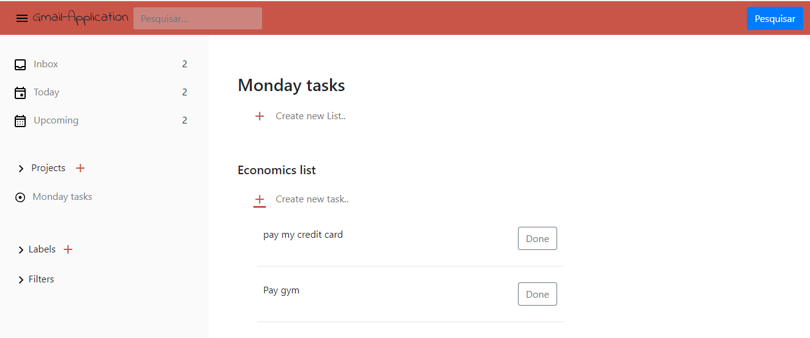
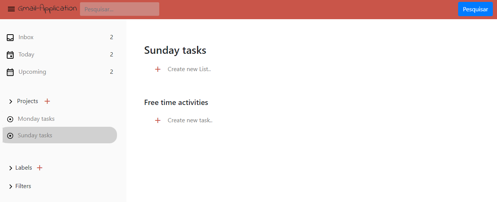
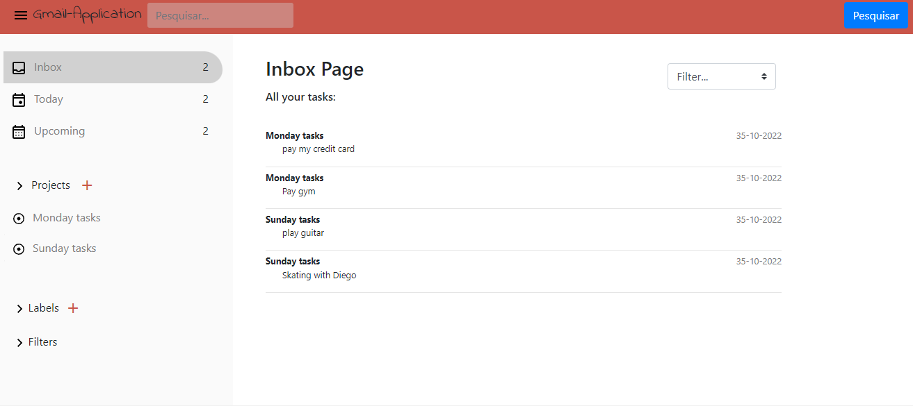

# Introduction

This was the first project where I could apply all the programming concepts I learned during my three-month learning period. It was a very special project, and I wouldn't have been able to complete it without grasping fundamental programming concepts such as variables, methods, event listeners (in the case of JavaScript), arrays, and much more.
The purpose was to build an **Gmail Web application** but with focus on **todo-list!**

## Technologies used

Vanila JavaScript CSS and SCSS.

## Features and functionality 

Gmail web application with focus on your todo-list. The application has 3 main pages: INBOX, TODAY and UPCOMING. 
This application allows you to create projects and then create a to-do list for each project. Every project created will be listed in the side-panel (left-corner) for easy acess.
Right from the beginning, on the Inbox page, users can see all the items from every project/list created throughout the application! The navigation style is similar to Google's official Gmail app, so that users can have no difficulty in using the app.

## Learning process 

With this project, I learned about the importance of arrays for better navigation between images. Additionally, I gained understanding about image positioning.

## How to run the project 

This project is public, if you want to use it on your computer is totaly free!
Here's the steps: 
* Clone the repository by copying its HTTPS URL or just copy this line
```bash
  https://github.com/SouzaThalez/gmail-application.git
```
* Run the project using you prefer IDE. I recommend using Visual Studio Code
* Once inside the project make sure node.js is installed on your computer, if you don't have it, download it here: [Download node.js](https://nodejs.org/en/download)
* Use npm command to run your server-side rendering. You can use this one:
```bash
  npm install -g http-server
```
* Than add the folowing command to run your project:
```bash
  http-server
```
 ## Preview
 This is what the Gmail applicaton looks like



Start by creating a new project


Projects we be listed in the side-panel


After project creation, open it and create a new list for the project



Add items to the list



You can create more Projects!



Now you can review all of the lists items in your inbox page. Each item with it's corresponding project name.



 ## Important notes
 This project is still under development so the other pages are not working
